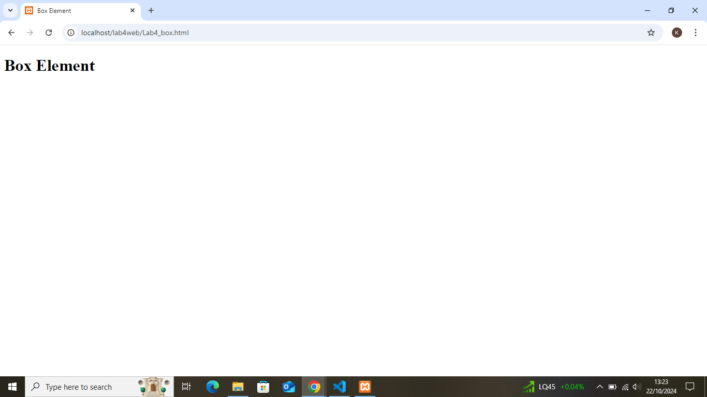
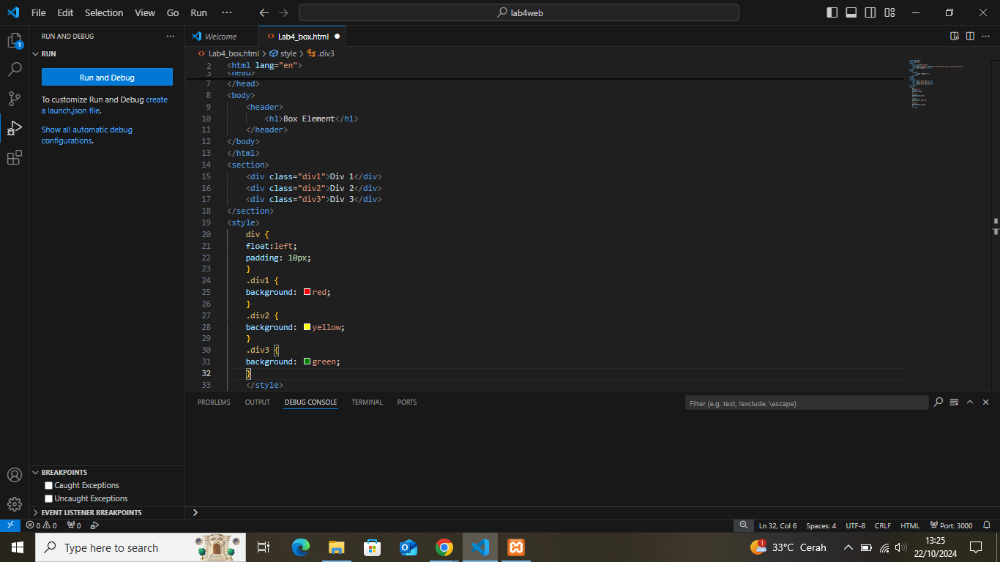
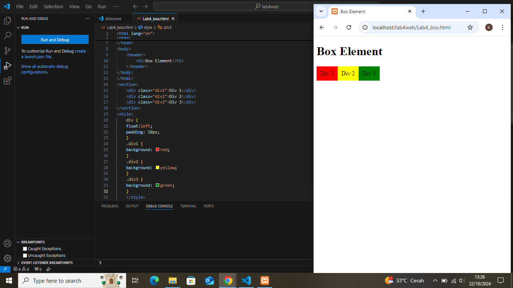
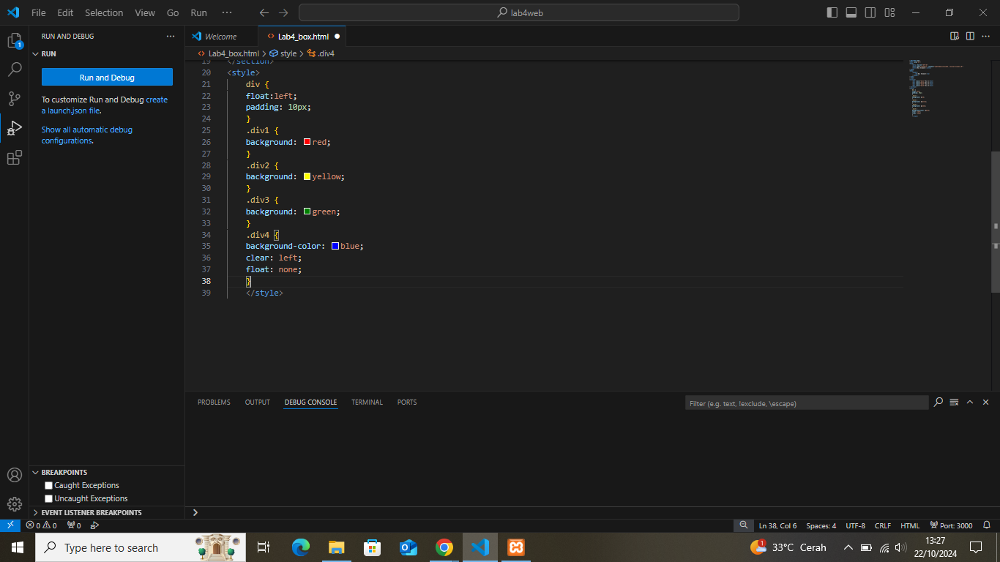
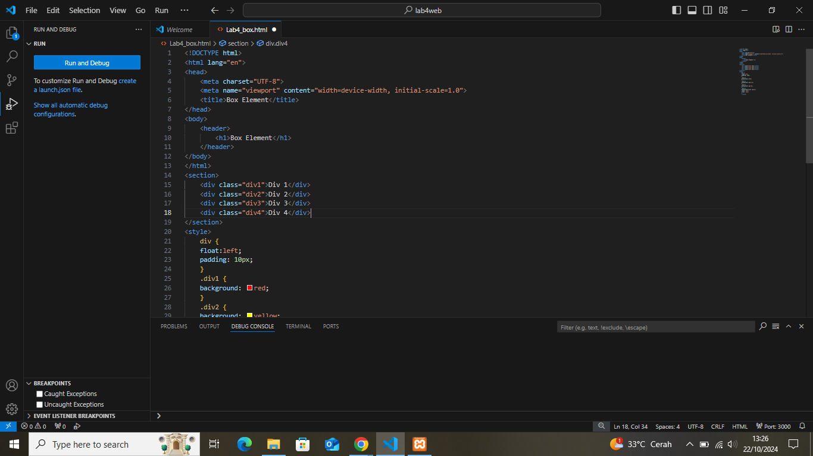
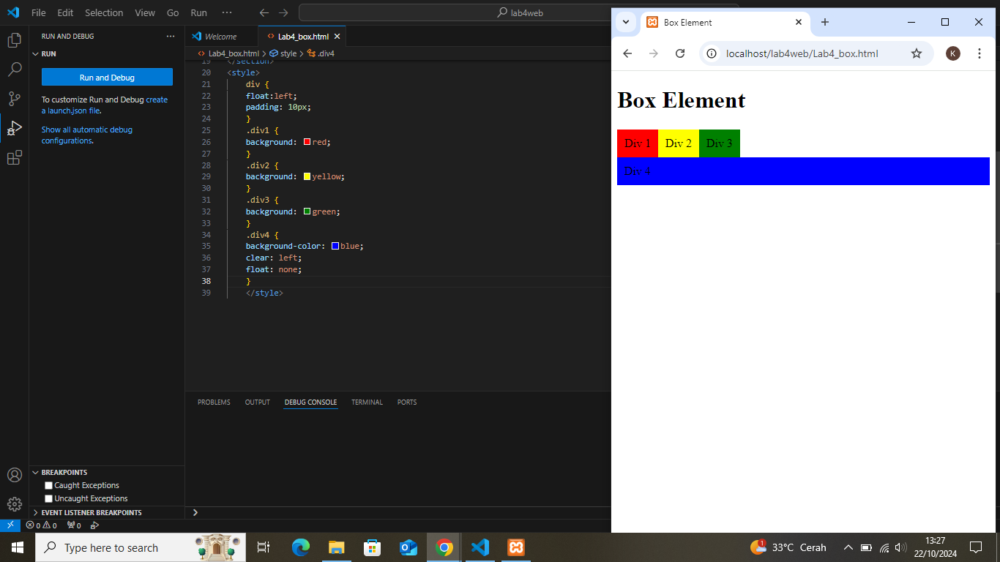
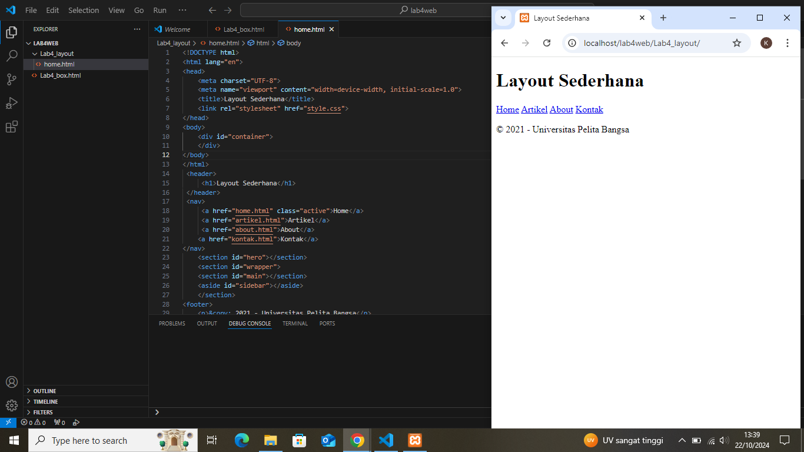
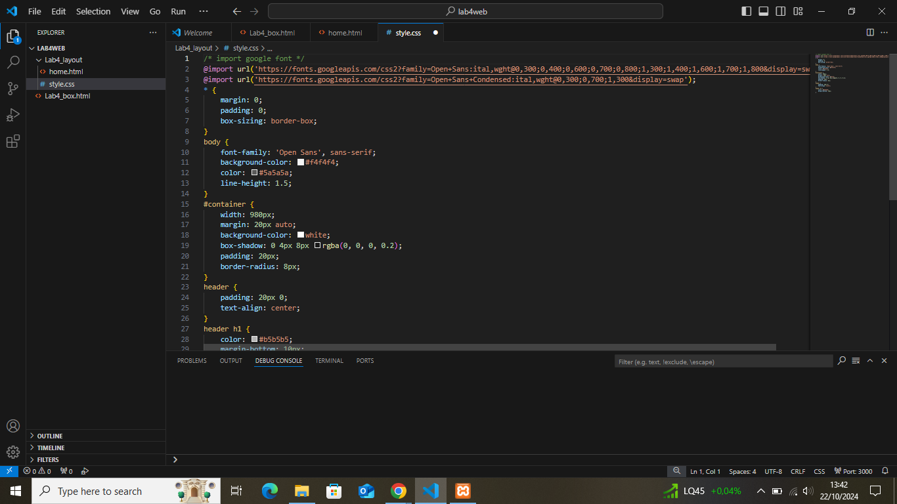
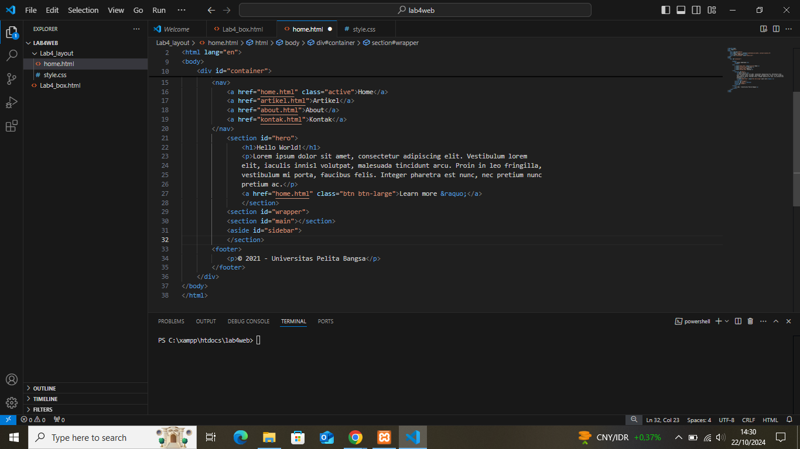
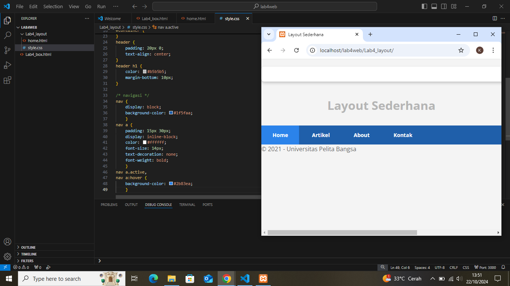

# Lab4web
## Nama  : Kemas Rafi Ramadhan
## NIM   : 312310346
## Kelas : TI.23.A4
## 1. membuat Folder baru dengan nama Lab4_box html kemudian tambahkan Box elemen dan mengatur css float properti
- Gambar1
  .png)
- Gambar2
  
# 2. Kemudian membuat beberapa paragraf sederhana
- Gambar result
  
# 3. Kemudian atur atribut paragraf dan menambahkan sub judul
- Gambar1
  
- Gambar result
  
# 4. Format teks pada paragraf tersebut
- Gambar result
  
# 5. Kemudian menyisipkan gambar kepada halaman web dan menambahkan judul
- Gambar1
  
- Gambar2
  
- Gambar result 1&2
  
# 6. Menambahkan Hyperlink pada dokumen tersebut
- Gambar1
  
- Final result
  
