# lab4web
|Nama|NIM|Kelas|Matkul|
|-----|-----|-----|-----|
|KEMASRAFIRAMADHAN|312310346|TI 23A.4|Pemog Web|

## 1. membuat Folder baru dengan nama Lab4_box html kemudian tambahkan Box elemen dan mengatur css float properti
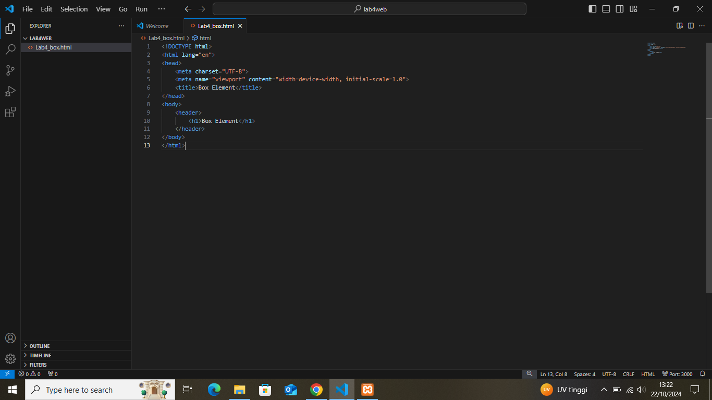

## 2. mengatur clearfix elemen

## 3.Kemudian membuat folder baru dengan nama lab4layout dan manambahkann folder baru dengan nama Home di dalam folder Lab4layout
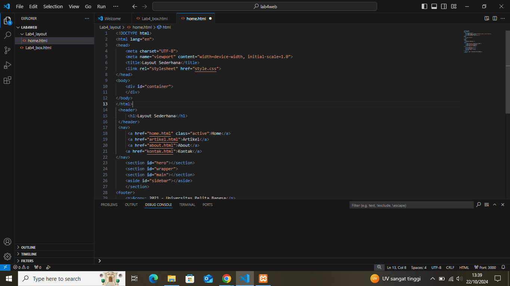

## 4.mengatur css layoutnya dan menambahkan link navigasi

## 5. Membuat Hero panel dan membuat sidebar widget, lalu atur layout main dan sidebar menggunakan css

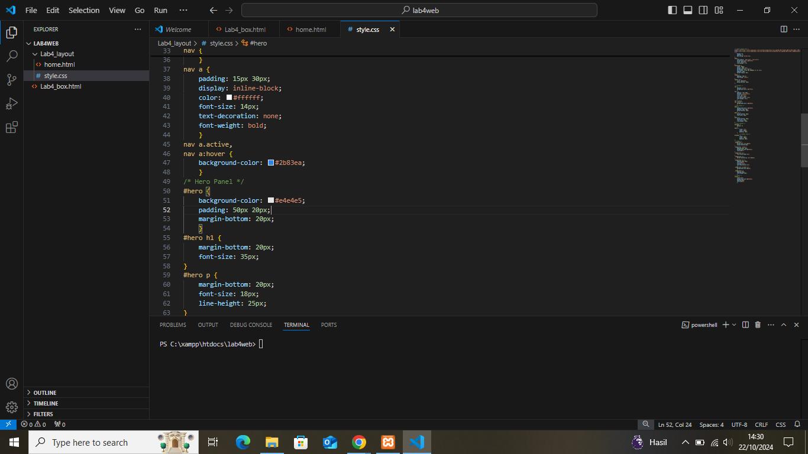
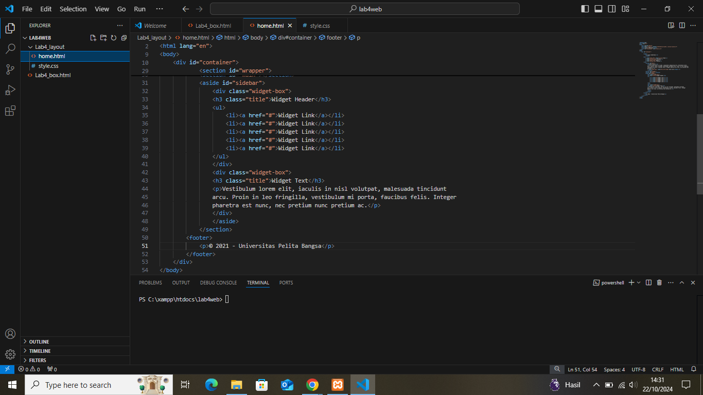
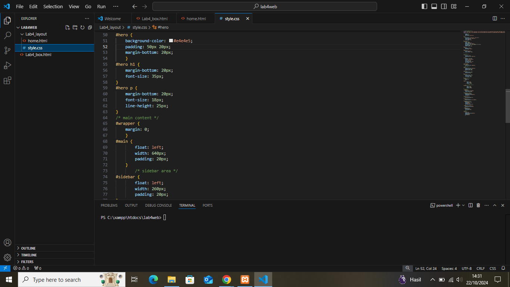
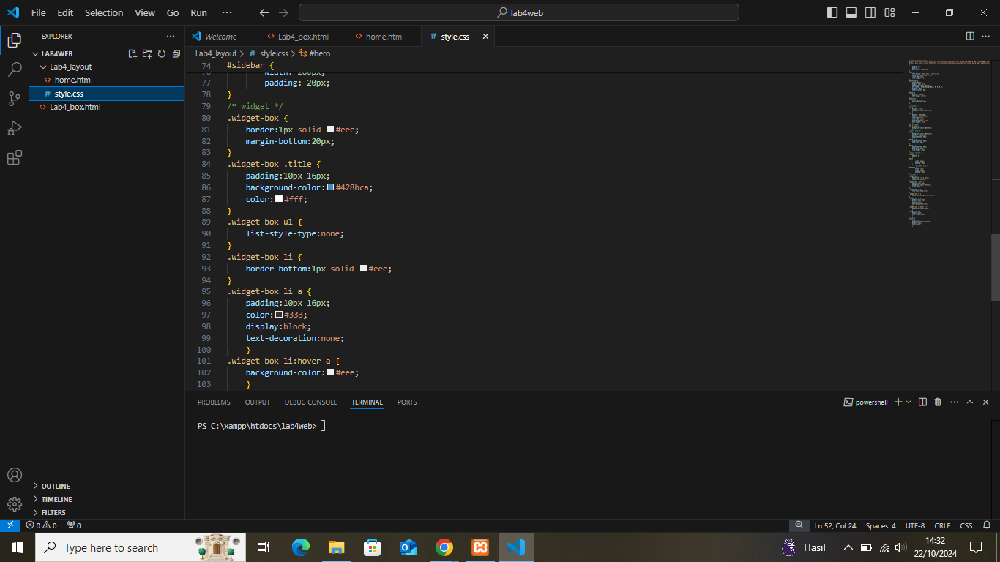
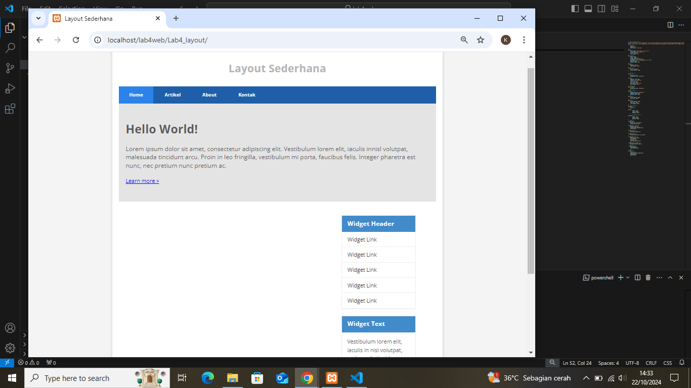

## 6. Mengatur Footer
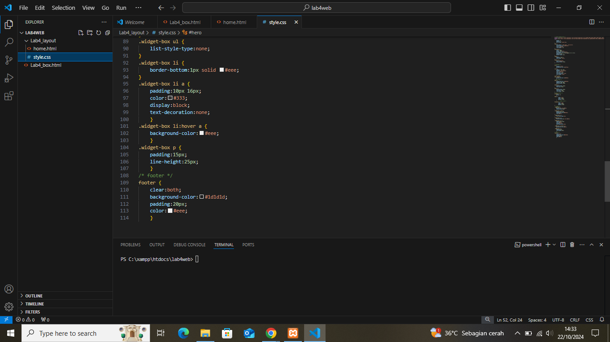
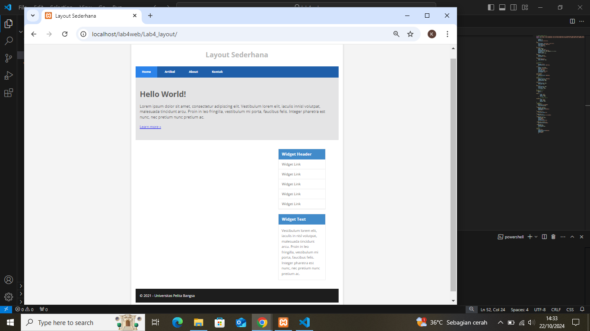

## 7. Menambahkan elemen lainnya di main content dan menambahkan style cssnya
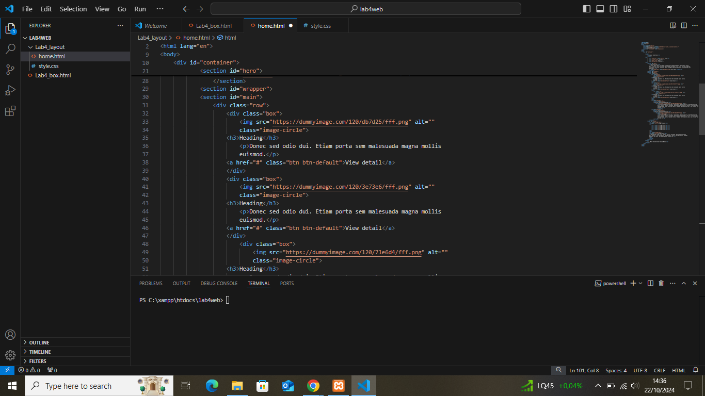
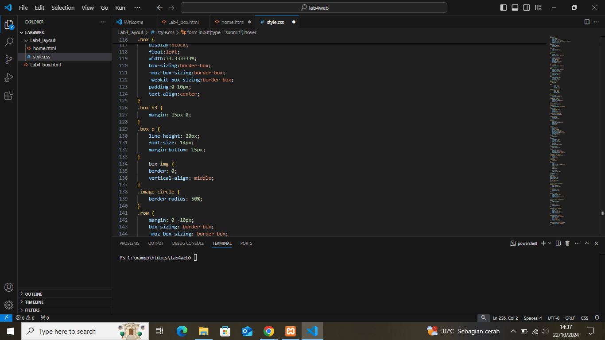
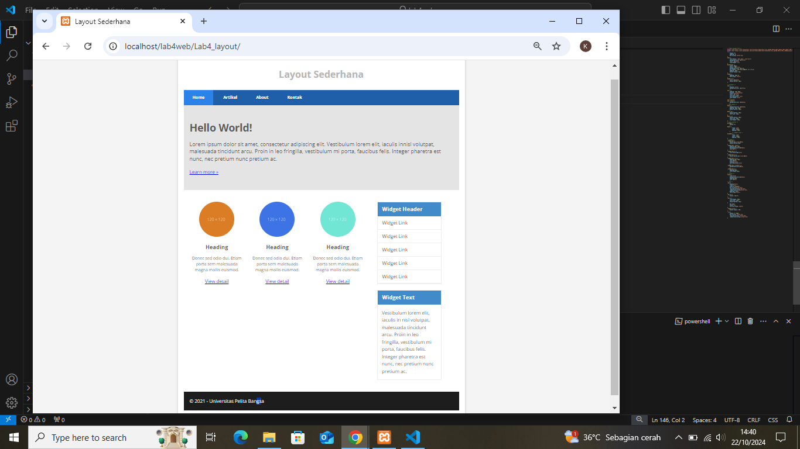

## 8. Menambahkan konten artikel dan menambahkan css
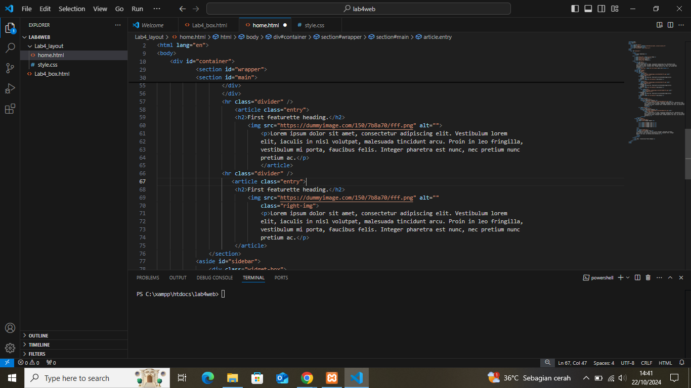
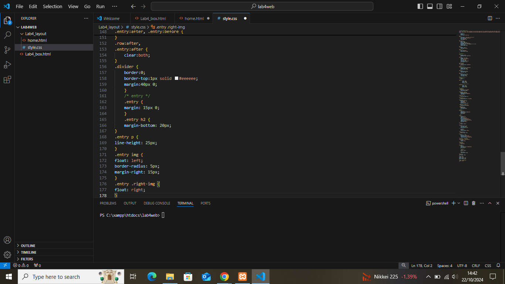
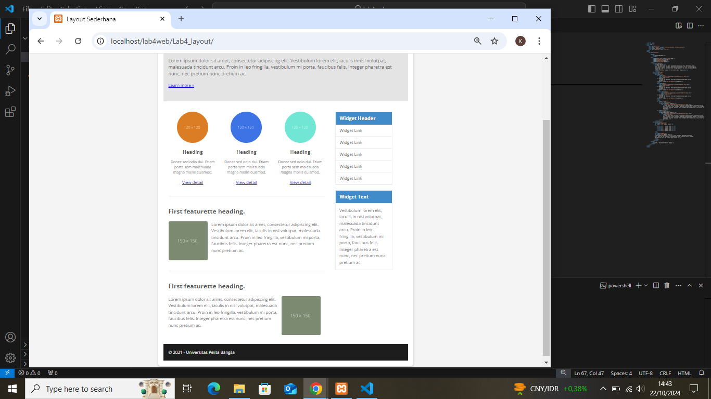

## PERTANYAAN DAN JAWABANNYA
Pertanyaan dan Tugas
1. Tambahkan Layout untuk menu About
=> buat single layout yang berisi deskripsi, portfolio, dll
2. Tambahkan layout untuk menu Contact
=> yang berisi form isian: nama, email, message, dll

-Jawaban No.1
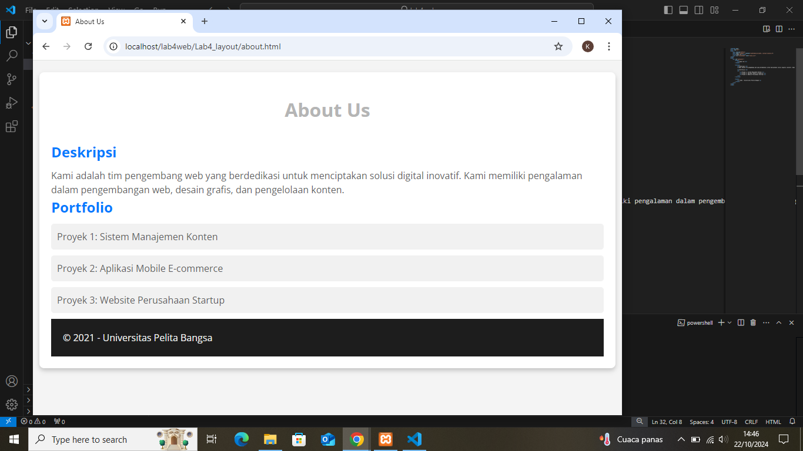
-jawaban no.2
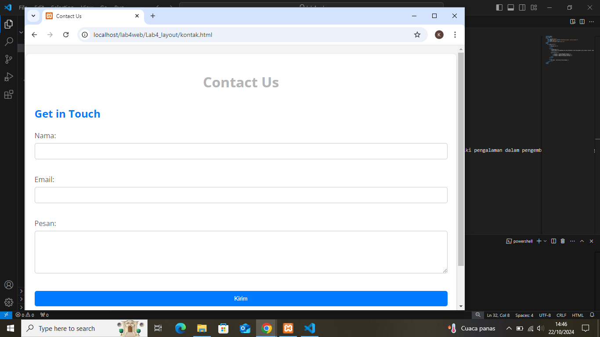
